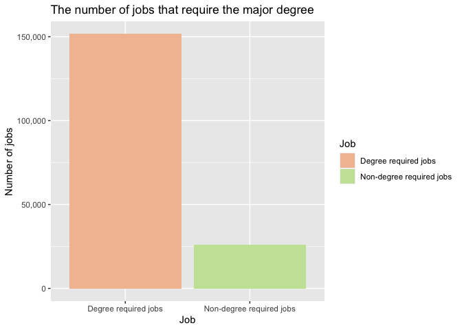

<!-- README.md is generated from README.Rmd. Please edit that file -->

# rankgradute

<!-- badges: start -->
<!-- badges: end -->

The goal of `rankgraduate` is to provide basic and easy-to-understand
information on the rank of major colleges in the United States with
Shiny Application. Moreover, this package provides the dataset of the
rank of graduates in the USA and the basic functions that users can use.

## Installation

You can install the development version of rankgraduate from
[GitHub](https://github.com/etc5523-2022/rpkg-aphiaut) with:

``` r
# install.packages("devtools")
devtools::install_github("etc5523-2022/rpkg-aphiaut")
```

## Get Started

``` r
library(rankgraduate)
```

``` r
# Launch shiny application
launch_app()
```

## An example of function

``` r
rankgraduate::employee("Nursing")
```



``` r
rankgraduate::table_rank(100000,40000)
#> # A tibble: 6 × 6
#>    Rank Major                                 Major_category P25th Median  P75th
#>   <dbl> <chr>                                 <chr>          <dbl>  <dbl>  <dbl>
#> 1     2 MINING AND MINERAL ENGINEERING        Engineering    55000  75000  90000
#> 2     3 METALLURGICAL ENGINEERING             Engineering    50000  73000 105000
#> 3     4 NAVAL ARCHITECTURE AND MARINE ENGINE… Engineering    43000  70000  80000
#> 4     5 CHEMICAL ENGINEERING                  Engineering    50000  65000  75000
#> 5     6 NUCLEAR ENGINEERING                   Engineering    50000  65000 102000
#> 6     7 ACTUARIAL SCIENCE                     Business       53000  62000  72000
```

## Learn More About the Package and Functions

Refer to the [pkgdown website](https://rankgraduate.netlify.app/)
